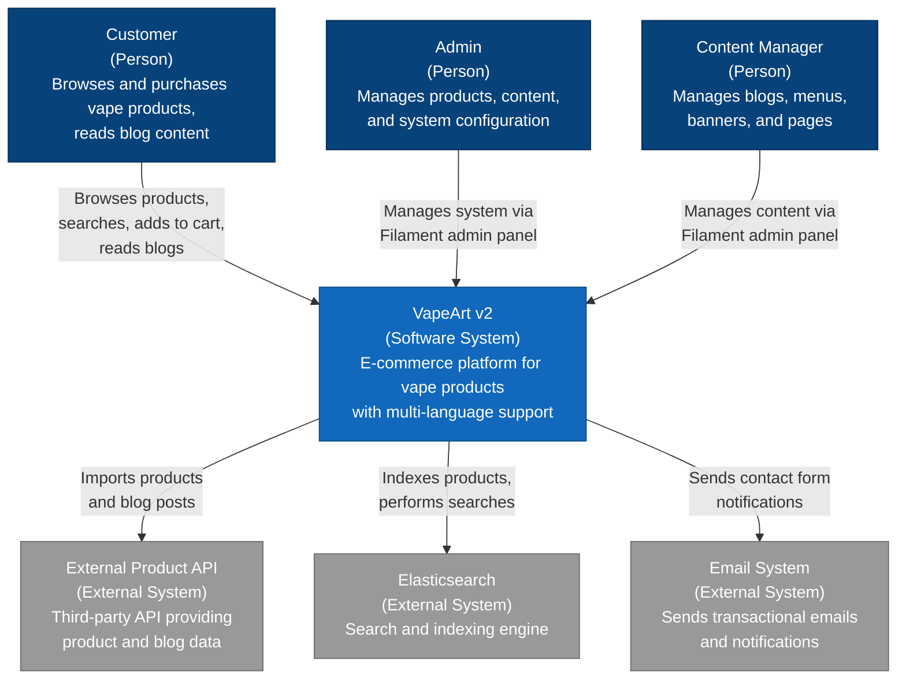

# C4 Model: Level 1 - System Context Diagram

## Overview

This diagram shows the VapeArt v2 e-commerce platform in the context of its users and external systems. It provides a high-level view of the system boundaries and interactions.

## System Context

## System Description

### VapeArt v2 E-Commerce Platform

A comprehensive e-commerce platform built with Laravel 12 framework for selling vape products. The system supports:

- **Multi-language**: Azerbaijani (az), English (en), Russian (ru)
- **Product Management**: Full product catalog with categories, brands, and tags
- **Content Management**: Blog system, static pages, menus, and banners
- **Search**: Advanced Elasticsearch-powered product search
- **Discounts**: Flexible discount system with percentage and fixed amounts
- **Reviews**: Customer reviews for products and blog posts
- **Admin Panel**: Filament 4-based administration interface

## Users

### Customer
End users who visit the website to:
- Browse and search products
- Filter by categories, brands, and tags
- View product details and reviews
- Add products to cart
- Read blog content
- Contact the company
- Manage wishlists

### Admin
System administrators who:
- Manage all system settings
- Configure roles and permissions
- Monitor system performance
- Manage users and access control
- Import products from external APIs
- Sync Elasticsearch indices

### Content Manager
Content editors who:
- Create and edit blog posts
- Manage product information
- Configure menus and navigation
- Design banner campaigns
- Manage static pages
- Moderate product reviews

## External Systems

### External Product API
Third-party REST API that provides:
- Product data with multi-language support
- Product images and media
- Brand and category information
- Blog post content
- Automatic synchronization via scheduled imports

### Elasticsearch
Search engine that provides:
- Full-text product search
- Real-time indexing
- Advanced filtering and faceting
- Autocomplete functionality
- Multi-language search support

### Email System
Email infrastructure for:
- Contact form notifications
- Order confirmations (future)
- Customer communications
- Admin notifications

## Key Interactions

| From | To | Purpose |
|------|-----|---------|
| Customer | VapeArt v2 | Browse products, search, view content |
| Admin/Content Manager | VapeArt v2 | Manage system via Filament admin panel |
| VapeArt v2 | External API | Import products and blog data |
| VapeArt v2 | Elasticsearch | Index and search products |
| VapeArt v2 | Email System | Send notifications |

## Supported Languages

The system supports complete multi-language functionality across all content types:
- **az** - Azerbaijani (default)
- **en** - English
- **ru** - Russian

All translatable content (products, categories, blogs, pages, etc.) is stored with translations for all three languages.
