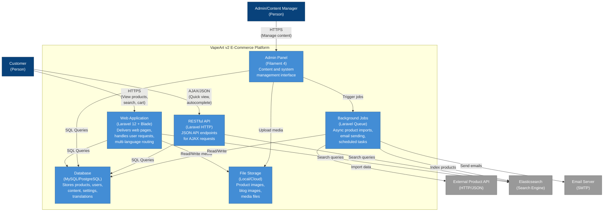

# C4 Model: Level 2 - Container Diagram

## Overview

This diagram shows the high-level technical building blocks (containers) of the VapeArt v2 system. Each container is a separately runnable/deployable unit that executes code or stores data.

## Container Diagram

## Container Descriptions

### Web Application (Laravel 12 + Blade)

**Technology:** PHP 8.2, Laravel 12, Blade Templates, Vite, TailwindCSS 4

**Responsibilities:**
- Serves web pages to customers
- Handles multi-language routing (az, en, ru)
- Processes HTTP requests and responses
- Implements MVC pattern
- Session management
- Authentication and authorization
- Cache management

**Key Features:**
- Server-side rendering with Blade templates
- Localized routes with `{locale}` prefix
- SEO-optimized pages
- Responsive design
- Shopping cart functionality
- Wishlist management
- Product filtering and pagination

**Port:** 8000 (development), 80/443 (production)

### Admin Panel (Filament 4)

**Technology:** PHP 8.2, Filament 4, Laravel Livewire

**Responsibilities:**
- Provides administrative interface
- Content management (CRUD operations)
- User and role management
- System configuration
- Dashboard and analytics
- Media library management

**Key Features:**
- Role-based access control (Spatie Permission)
- Multi-language content editing
- Batch operations
- File uploads (Spatie Media Library)
- Data export/import
- Real-time validation

**Access:** `/admin` route, authenticated users only

### RESTful API (Laravel HTTP)

**Technology:** PHP 8.2, Laravel 12, JSON

**Responsibilities:**
- AJAX endpoint responses
- Cart operations
- Search autocomplete
- Quick product view
- Load more pagination
- Branch information

**Key Endpoints:**
- `GET /search/autocomplete` - Search suggestions
- `GET /quick-view` - Product quick view modal
- `POST /cart/add` - Add to cart
- `GET /cart/branches` - Get store branches
- `GET /products/load-more` - Infinite scroll
- `GET /brands/load-more` - Infinite scroll
- `POST /products/{id}/reviews` - Submit review

**Format:** JSON responses for frontend JavaScript consumption

### Background Jobs (Laravel Queue)

**Technology:** PHP 8.2, Laravel Queue System

**Responsibilities:**
- Asynchronous task processing
- Product import from external API
- Blog import from external API
- Elasticsearch synchronization
- Email notifications
- Scheduled tasks (cron)

**Queue Jobs:**
- `ImportProductsJob` - Imports products with pagination
- `ImportBlogsJob` - Imports blog posts
- `SyncProductsToElasticsearch` - Daily sync at 00:00

**Queue Driver:** Database (configurable to Redis/SQS)

### Database (MySQL/PostgreSQL)

**Technology:** MySQL 8.0+ or PostgreSQL 14+

**Responsibilities:**
- Persistent data storage
- Relational data management
- Transaction support
- Query optimization

**Key Tables:**
- `users` - User accounts and authentication
- `products` - Product catalog
- `categories` - Product categories (hierarchical)
- `brands` - Product brands
- `tags` - Product tags
- `blogs` - Blog posts
- `pages` - Static pages
- `menus` - Navigation menus
- `banners` - Marketing banners
- `reviews` - Product and blog reviews
- `discounts` - Discount campaigns
- `branches` - Store branches
- `contact_messages` - Contact form submissions
- `settings` - System configuration
- `media` - File metadata (Spatie Media Library)
- `permissions` & `roles` - Access control

**Migrations:** 26 migration files

### File Storage (Local/Cloud)

**Technology:** Laravel Filesystem (Local, S3, etc.)

**Responsibilities:**
- Store uploaded media files
- Serve product images
- Store blog images
- Media conversions (thumbnails, responsive sizes)

**Collections:**
- `thumbnail` - Product main image
- `images` - Product gallery images
- `featured` - Blog featured images
- `banners` - Banner images

**Image Conversions:**
- `thumb` - Thumbnail (300x300)
- `medium` - Medium size (600x600)
- `large` - Full size

## Data Flow Examples

### Customer Browsing Products

1. Customer visits `/{locale}/products`
2. **Web Application** receives request
3. **Web Application** queries **Database** for active products
4. **Web Application** renders Blade template
5. Customer sees product listing
6. Customer scrolls down (infinite scroll)
7. JavaScript calls **API** endpoint `/products/load-more`
8. **API** returns JSON with next page
9. Frontend appends products to page

### Product Search

1. Customer types in search box
2. JavaScript calls **API** `/search/autocomplete`
3. **API** queries **Elasticsearch**
4. **Elasticsearch** returns matching products
5. **API** formats and returns JSON
6. Frontend displays suggestions
7. Customer submits search
8. **Web Application** performs full search via **Elasticsearch**
9. Results page rendered with filters

### Admin Importing Products

1. Admin runs `php artisan products:import --queue`
2. Command dispatches **ImportProductsJob** to queue
3. **Background Jobs** processor picks up job
4. Job fetches data from **External API** (paginated)
5. Job processes each product:
   - Creates/updates record in **Database**
   - Downloads images to **File Storage**
   - Creates media records
6. Job completion triggers notification
7. Admin runs `php artisan elasticsearch:sync`
8. Sync command indexes products to **Elasticsearch**

### Nightly Elasticsearch Sync

1. Laravel Scheduler triggers at 00:00
2. `SyncProductsToElasticsearch` command runs
3. Command queries all active products from **Database**
4. Products indexed in batches to **Elasticsearch**
5. Inactive products removed from index
6. Log written to `storage/logs/elasticsearch-sync.log`

## Technology Stack Summary

| Container | Primary Technology | Framework/Library |
|-----------|-------------------|-------------------|
| Web Application | PHP 8.2, Laravel 12 | Blade, Vite, TailwindCSS |
| Admin Panel | PHP 8.2, Filament 4 | Livewire, Alpine.js |
| API | PHP 8.2, Laravel | JSON, RESTful |
| Background Jobs | PHP 8.2, Laravel Queue | Cron, Queue Workers |
| Database | MySQL/PostgreSQL | Eloquent ORM |
| File Storage | Local/S3 | Spatie Media Library |

## Communication Protocols

| From | To | Protocol | Format |
|------|-----|----------|--------|
| Customer | Web App | HTTPS | HTML |
| Customer | API | HTTPS | JSON |
| Admin | Admin Panel | HTTPS | HTML (Livewire) |
| Web App | Database | TCP | SQL |
| API | Elasticsearch | HTTP | JSON |
| Background Jobs | External API | HTTPS | JSON |
| Background Jobs | Email | SMTP | MIME |

## Scalability Considerations

- **Horizontal Scaling:** Web Application and API can be load-balanced
- **Cache Layer:** Laravel cache for frequent queries (products, menus, settings)
- **CDN:** File Storage can use CDN for media delivery
- **Queue Workers:** Multiple queue workers can process jobs in parallel
- **Database:** Read replicas for query scaling
- **Elasticsearch:** Cluster configuration for high availability
