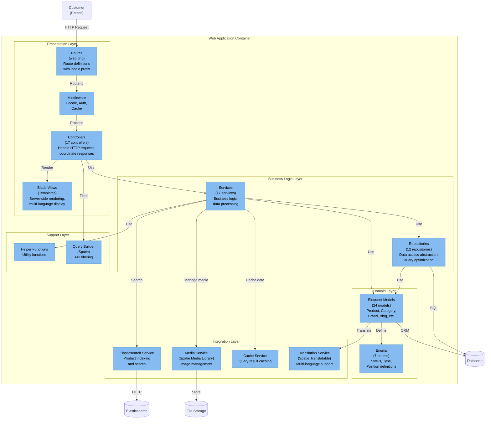
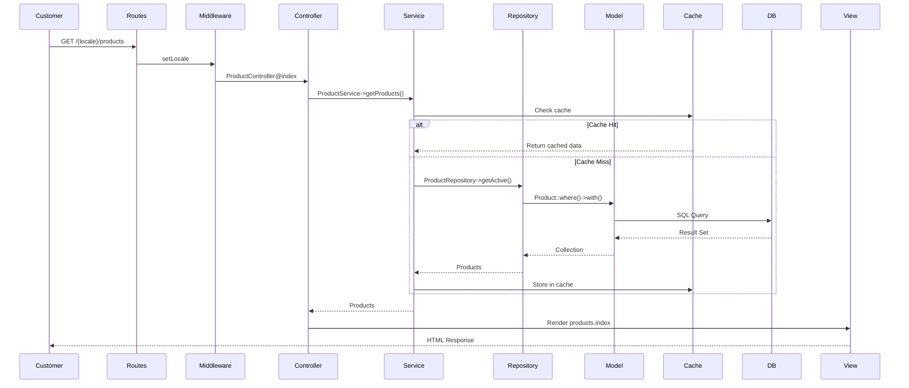

# C4 Model: Level 3 - Component Diagram

## Overview

This diagram shows the internal components of the Web Application container, breaking down the architecture into key modules and their interactions.

## Component Diagram - Web Application



## Layer Descriptions

### Presentation Layer

Handles HTTP request/response cycle and user interface rendering.

#### Routes (`routes/web.php`)
- Locale-prefixed routing: `/{locale}/...`
- Route groups with middleware
- Named routes for easy referencing
- 96 lines of route definitions

**Key Route Groups:**
- Home and static pages
- Blog (index, show, load-more)
- Products (index, show, load-more)
- Categories and brands
- Cart and wishlist
- Search and autocomplete
- Contact forms
- Reviews

#### Controllers (17 Controllers)

All controllers extend base `Controller` class and handle specific domains:

| Controller | Responsibility |
|------------|----------------|
| `HomeController` | Homepage, featured products, banners |
| `ProductController` | Product listing, detail, filtering |
| `CategoryController` | Category listing and products |
| `BrandController` | Brand listing and products |
| `BlogController` | Blog listing and articles |
| `PageController` | Static pages (About, Terms, etc.) |
| `MenuController` | Dynamic menus and navigation |
| `BannerController` | Banner display by position |
| `CartController` | Shopping cart operations |
| `WishlistController` | Wishlist management |
| `SearchController` | Product search and autocomplete |
| `ReviewController` | Product and blog reviews |
| `ContactController` | Contact form submission |
| `DiscountController` | Discounted products |
| `NewProductsController` | New arrivals |
| `QuickViewController` | Quick view modal |

**Pattern:** Controllers are thin, delegating business logic to Services.

#### Views (Blade Templates)

Server-side rendered templates organized by feature:

**Structure:**
```
resources/views/
├── layouts/        # Master layout
├── pages/          # Page templates (26 pages)
├── components/     # Reusable components
├── includes/       # Partials (11 includes)
├── forms/          # Form components
└── emails/         # Email templates
```

**Features:**
- Blade directives for translations
- Component-based architecture
- SEO meta tags
- Responsive design
- Multi-language content

#### Middleware

- `setLocale` - Detects and sets application locale
- Authentication middleware (Filament)
- Cache middleware
- CORS middleware

### Business Logic Layer

Contains core business logic separated from controllers.

#### Services (17 Services)

Services implement business operations and orchestrate repositories:

| Service | Responsibility |
|---------|----------------|
| `ProductService` | Product operations, filtering |
| `CategoryService` | Category tree, caching |
| `BrandService` | Brand operations |
| `BlogService` | Blog CRUD, pagination |
| `PageService` | Static page management |
| `MenuService` | Menu building |
| `BannerService` | Banner management by position |
| `ReviewService` | Review submission |
| `TagService` | Tag operations |
| `BranchService` | Store branch info |
| `ContactMessageService` | Contact form handling |
| `ElasticsearchService` | Search indexing and queries |
| `ProductImportService` | External API import |
| `BlogImportService` | Blog import from API |
| `SitemapGenerator` | SEO sitemap generation |
| `Settings` | System settings management |
| `AbstractService` | Base service class |

**Service Pattern:**
```php
class ProductService extends AbstractService
{
    public function __construct(
        protected ProductRepository $repository,
        protected ElasticsearchService $elasticsearch
    ) {}
    
    public function getFeaturedProducts(int $limit = 8)
    {
        return Cache::remember("featured_products_$limit", 3600, 
            fn() => $this->repository->getFeatured($limit)
        );
    }
}
```

#### Repositories (12 Repositories)

Repositories abstract database access:

| Repository | Model | Special Features |
|------------|-------|------------------|
| `ProductRepository` | Product | Complex filtering, discounts |
| `CategoryRepository` | Category | Tree structure |
| `BrandRepository` | Brand | Product counting |
| `BlogRepository` | Blog | Pagination, featured |
| `PageRepository` | Page | Slug lookup |
| `MenuRepository` | Menu | Position-based |
| `BannerRepository` | Banner | Position filtering |
| `BranchRepository` | Branch | Default branch |
| `ReviewRepository` | Review | Polymorphic |
| `TagRepository` | Tag | Product relations |
| `ContactMessageRepository` | ContactMessage | Form storage |
| `BaseRepository` | Abstract | Common CRUD operations |

**Repository Pattern:**
```php
class ProductRepository extends BaseRepository
{
    public function getFeatured(int $limit)
    {
        return $this->model
            ->where('is_featured', true)
            ->where('is_active', true)
            ->limit($limit)
            ->get();
    }
}
```

### Domain Layer

Contains domain models and business entities.

#### Eloquent Models (24 Models)

Each model represents a database table:

| Model | Traits | Key Features |
|-------|--------|--------------|
| `Product` | HasTranslations, HasMedia, Searchable | Multi-language, images, search |
| `Category` | HasTranslations, Sortable | Hierarchical, sortable |
| `Brand` | HasTranslations, HasMedia | Logo support |
| `Blog` | HasTranslations, HasMedia | Featured image |
| `Page` | HasTranslations | Static content |
| `Menu` | HasTranslations | Navigation |
| `Banner` | HasTranslations, HasMedia | Marketing |
| `Tag` | HasTranslations | Tagging |
| `Review` | MorphTo | Polymorphic relations |
| `User` | HasRoles, HasPermissions | RBAC |
| `Discount` | - | Campaigns |
| `Branch` | HasTranslations | Store locations |
| `Setting` | - | Key-value config |
| `ContactMessage` | - | Form submissions |

**Model Relationships:**
- `Product` belongs to `Brand`
- `Product` belongs to many `Category`
- `Product` belongs to many `Tag`
- `Product` belongs to many `Discount`
- `Product` has many `Review` (morph)
- `Category` has many `Product`
- `Menu` has many `Product`

#### Enums (7 Enums)

Type-safe enumerations for status and configuration:

| Enum | Values | Usage |
|------|--------|-------|
| `BannerPosition` | TOP, BOTTOM, SIDEBAR, etc. | Banner placement |
| `MenuPosition` | HEADER, FOOTER, etc. | Menu location |
| `DiscountType` | PERCENTAGE, FIXED | Discount calculation |
| `WidgetType` | Various widget types | Widget configuration |
| `ReviewStatus` | PENDING, APPROVED, REJECTED | Review moderation |
| `UserRole` | ADMIN, MANAGER, etc. | User roles |
| `ProductStatus` | (via is_active boolean) | Product visibility |

### Integration Layer

Integrates with external services and libraries.

#### Elasticsearch Service

**File:** `app/Services/ElasticsearchService.php`

**Responsibilities:**
- Create and manage indices
- Index product data
- Perform searches with filters
- Autocomplete functionality
- Multi-language search

**Key Methods:**
```php
createIndex()                    // Create search index
indexProduct(Product $product)   // Index single product
bulkIndex(Collection $products)  // Batch indexing
search(string $query, array $filters)  // Search products
removeFromIndex(int $productId)  // Delete from index
```

**Index Mapping:**
```json
{
  "name": { "type": "text", "analyzer": "standard" },
  "description": { "type": "text" },
  "price": { "type": "float" },
  "brand_id": { "type": "integer" },
  "category_ids": { "type": "integer" },
  "is_active": { "type": "boolean" }
}
```

#### Media Service (Spatie Media Library)

**Package:** `spatie/laravel-medialibrary`

**Responsibilities:**
- Upload and store files
- Generate responsive images
- Create thumbnails
- Manage media collections

**Collections:**
- `thumbnail` - Product main image
- `images` - Product gallery
- `featured` - Blog featured image
- `banners` - Banner images
- `logos` - Brand logos

**Conversions:**
- `thumb` - 300x300px
- `medium` - 600x600px
- `large` - Full size

#### Cache Service

**Driver:** File/Redis (configurable)

**Cached Entities:**
- Products (featured, new, discounted)
- Categories (tree structure)
- Menus (by position)
- Banners (by position)
- Settings (system configuration)

**TTL:** 3600 seconds (1 hour)

**Cache Keys:**
```
featured_products_{limit}
category_tree
menu_{position}
banners_{position}
settings
```

**Auto-invalidation:** Cache cleared on Filament create/update/delete

#### Translation Service (Spatie Translatable)

**Package:** `spatie/laravel-translatable`

**Supported Locales:** az, en, ru

**Translatable Fields:**
- `name` / `title`
- `description` / `body`
- `specs` / `info`
- `excerpt`
- `meta_title`
- `meta_description`

**Usage:**
```php
$product->name              // Current locale
$product->getTranslation('name', 'en')  // Specific locale
$product->setTranslation('name', 'az', 'Məhsul')  // Set translation
```

### Support Layer

Utility functions and helpers.

#### Helper Functions

**File:** `app/Support/helpers.php`

Common utility functions autoloaded globally:
- `setting($key, $default)` - Get system setting
- `locale()` - Get current locale
- `formatPrice($amount)` - Format currency
- etc.

#### Query Builder (Spatie)

**Package:** `spatie/laravel-query-builder`

**Features:**
- Filter products by multiple criteria
- Sort by various fields
- Include related models
- Pagination

**Example:**
```php
QueryBuilder::for(Product::class)
    ->allowedFilters(['brand_id', 'category_id', 'is_featured'])
    ->allowedSorts('price', 'created_at')
    ->allowedIncludes('brand', 'categories')
    ->paginate();
```

## Data Flow - Product Display



## Architecture Patterns

### Repository Pattern

Abstracts data access logic from business logic:
- Controllers don't query databases directly
- Services use repositories for data operations
- Repositories encapsulate Eloquent queries
- Easy to swap implementations (e.g., for testing)

### Service Layer Pattern

Business logic separated from controllers:
- Controllers are thin, handling only HTTP concerns
- Services contain reusable business operations
- Services can use multiple repositories
- Services handle caching strategies

### Dependency Injection

Laravel's service container manages dependencies:
- Constructor injection in controllers and services
- Automatic resolution
- Testability through interfaces

### Observer Pattern

Model events trigger automatic actions:
- Cache invalidation on model updates
- Elasticsearch re-indexing on product save
- Media deletion on model delete

### Facade Pattern

Laravel facades provide static interface:
- `Cache::remember()`
- `DB::transaction()`
- `Log::info()`

## Component Dependencies

```
Controllers → Services → Repositories → Models → Database
              ↓
         Elasticsearch Service
         Media Service
         Cache Service
         Translation Service
```

## Key Design Decisions

1. **Repository Pattern** - Abstraction for testability and maintainability
2. **Service Layer** - Centralized business logic
3. **Cache Strategy** - Aggressive caching with auto-invalidation
4. **Multi-language** - JSON columns for translations
5. **Elasticsearch** - Dedicated search engine for performance
6. **Media Library** - Standardized media management
7. **Enum Classes** - Type-safe constants (PHP 8.2)
8. **Blade Components** - Reusable UI components
9. **Queue Jobs** - Async processing for heavy operations
10. **API Resources** - Consistent JSON responses
