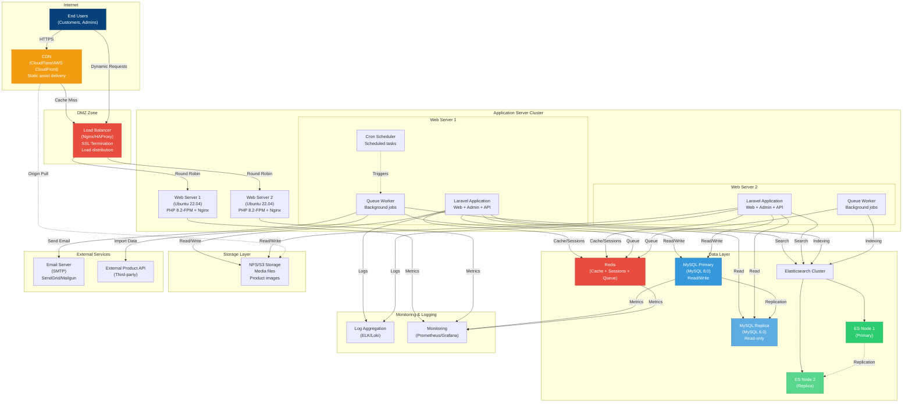
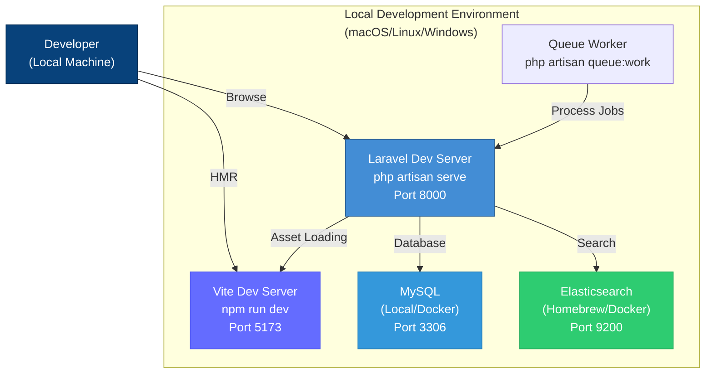

# Deployment Diagram

## Overview

This diagram shows how the VapeArt v2 system is deployed across different environments and infrastructure components.

## Production Deployment Architecture



## Development Environment



## Deployment Environments

### Development Environment

**Purpose:** Local development and testing

**Infrastructure:**
- **OS:** macOS / Linux / Windows
- **Web Server:** Laravel built-in server (port 8000)
- **Database:** MySQL local / Docker
- **Elasticsearch:** Homebrew / Docker
- **Cache:** File-based cache
- **Queue:** Database driver
- **Asset Server:** Vite dev server (HMR enabled)

**Commands:**
```bash
php artisan serve --host=192.168.0.109 --port=8000
npm run dev
php artisan queue:work
php artisan schedule:work
```

**Configuration (.env):**
```env
APP_ENV=local
APP_DEBUG=true
CACHE_DRIVER=file
SESSION_DRIVER=file
QUEUE_CONNECTION=database
```

### Staging Environment

**Purpose:** Pre-production testing and QA

**Infrastructure:**
- **OS:** Ubuntu 22.04 LTS
- **Web Server:** Nginx + PHP-FPM
- **Database:** MySQL 8.0 (Single instance)
- **Elasticsearch:** Single node
- **Cache:** Redis
- **Queue:** Redis
- **Storage:** Local filesystem

**Services:**
- **Nginx:** Reverse proxy and static file serving
- **PHP-FPM:** PHP process manager (pool of workers)
- **MySQL:** Database server
- **Redis:** Cache, sessions, and queue
- **Elasticsearch:** Search engine
- **Supervisor:** Queue worker process management

**Configuration:**
```env
APP_ENV=staging
APP_DEBUG=false
CACHE_DRIVER=redis
SESSION_DRIVER=redis
QUEUE_CONNECTION=redis
```

### Production Environment

**Purpose:** Live customer-facing application

**Infrastructure:**
- **OS:** Ubuntu 22.04 LTS
- **Load Balancer:** Nginx/HAProxy with SSL termination
- **Web Servers:** 2+ Nginx + PHP-FPM instances
- **Database:** MySQL 8.0 Primary + Replica
- **Elasticsearch:** 2-node cluster (Primary + Replica)
- **Cache/Queue:** Redis (clustered)
- **Storage:** NFS or S3-compatible storage
- **CDN:** CloudFlare / AWS CloudFront

**High Availability Features:**
- Load balancing across multiple web servers
- Database replication (Primary-Replica)
- Elasticsearch cluster
- Redis with persistence
- Shared storage (NFS/S3)
- SSL/TLS encryption
- Automated backups

**Configuration:**
```env
APP_ENV=production
APP_DEBUG=false
CACHE_DRIVER=redis
SESSION_DRIVER=redis
QUEUE_CONNECTION=redis
FILESYSTEM_DISK=s3
```

## Server Specifications

### Web Application Servers

**Minimum Requirements:**
- **CPU:** 2 vCPUs
- **RAM:** 4GB
- **Storage:** 40GB SSD
- **Network:** 1 Gbps

**Recommended (Production):**
- **CPU:** 4 vCPUs
- **RAM:** 8GB
- **Storage:** 80GB SSD
- **Network:** 1 Gbps

**Software Stack:**
- Ubuntu 22.04 LTS
- Nginx 1.22+
- PHP 8.2 with extensions: pdo_mysql, mbstring, xml, gd, curl, zip, redis
- Composer 2.x
- Node.js 18.x + NPM

### Database Server (MySQL)

**Minimum Requirements:**
- **CPU:** 2 vCPUs
- **RAM:** 4GB
- **Storage:** 100GB SSD
- **IOPS:** 3000+

**Recommended (Production):**
- **CPU:** 4 vCPUs
- **RAM:** 16GB
- **Storage:** 200GB SSD (provisioned IOPS)
- **IOPS:** 6000+

**Configuration:**
- InnoDB storage engine
- UTF8MB4 character set
- Binary logging (for replication)
- Automated daily backups
- Point-in-time recovery enabled

### Elasticsearch Cluster

**Per Node Requirements:**
- **CPU:** 2 vCPUs
- **RAM:** 8GB (heap: 4GB)
- **Storage:** 100GB SSD
- **IOPS:** High

**Configuration:**
- 2 nodes minimum (Primary + Replica)
- JVM Heap: 50% of RAM (max 4GB per node)
- Index replicas: 1
- Shard count: based on data size

### Redis Server

**Requirements:**
- **CPU:** 2 vCPUs
- **RAM:** 4GB
- **Storage:** 20GB SSD

**Configuration:**
- Persistence: RDB + AOF
- Max memory policy: allkeys-lru
- Used for: Cache, Sessions, Queue

### Storage (NFS/S3)

**Capacity:** 500GB+ (scalable)
**Backup:** Daily snapshots
**CDN Integration:** CloudFlare/CloudFront origin

## Network Architecture

### Ports and Protocols

| Service | Port | Protocol | Access |
|---------|------|----------|--------|
| HTTP | 80 | TCP | Public |
| HTTPS | 443 | TCP | Public |
| MySQL | 3306 | TCP | Internal only |
| Redis | 6379 | TCP | Internal only |
| Elasticsearch | 9200 | HTTP | Internal only |
| PHP-FPM | 9000 | FastCGI | localhost |
| SSH | 22 | TCP | Admin only |

### Firewall Rules

**Public Access:**
- Port 80 (HTTP) - Redirect to HTTPS
- Port 443 (HTTPS) - All traffic

**Internal Network Only:**
- MySQL (3306)
- Redis (6379)
- Elasticsearch (9200)

**Admin Access Only:**
- SSH (22) - Key-based authentication

## SSL/TLS Configuration

**Certificates:**
- Let's Encrypt (free, auto-renewal)
- Or commercial SSL certificate

**Configuration:**
- TLS 1.2+ only
- Strong cipher suites
- HSTS enabled
- Perfect Forward Secrecy

## Process Management

### Supervisor Configuration

Queue workers managed by Supervisor for auto-restart:

**File:** `/etc/supervisor/conf.d/vapeart-worker.conf`

```ini
[program:vapeart-worker]
process_name=%(program_name)s_%(process_num)02d
command=php /var/www/vapeart-v2/artisan queue:work --sleep=3 --tries=3 --max-time=3600
autostart=true
autorestart=true
stopasgroup=true
killasgroup=true
user=www-data
numprocs=4
redirect_stderr=true
stdout_logfile=/var/www/vapeart-v2/storage/logs/worker.log
stopwaitsecs=3600
```

### Cron Jobs

**File:** `/etc/cron.d/vapeart-scheduler`

```bash
* * * * * www-data cd /var/www/vapeart-v2 && php artisan schedule:run >> /dev/null 2>&1
```

**Scheduled Tasks:**
- `00:00` - Daily Elasticsearch sync
- `03:00` - Database backup
- `04:00` - Log rotation
- `05:00` - Cache warming

## Backup Strategy

### Database Backups

**Frequency:** Daily (automated)
**Retention:** 30 days
**Method:** mysqldump + compression
**Storage:** Off-site (S3/BackBlaze)

**Command:**
```bash
mysqldump -u backup_user -p vapeart_db | gzip > backup_$(date +%Y%m%d).sql.gz
```

### File Backups

**Frequency:** Weekly
**Scope:** Uploaded media files
**Method:** rsync or S3 sync
**Retention:** 90 days

### Application Code

**Method:** Git repository
**Deployment:** Git pull + composer install
**Rollback:** Git checkout previous tag

## Monitoring & Logging

### Application Logs

**Location:** `storage/logs/`
**Files:**
- `laravel.log` - Application errors
- `queue-worker.log` - Queue processing
- `elasticsearch-sync.log` - Search sync

**Rotation:** Daily, keep 14 days

**Log Level (Production):** `error`

### System Monitoring

**Tools:**
- **Prometheus** - Metrics collection
- **Grafana** - Visualization
- **AlertManager** - Alert notifications

**Metrics:**
- CPU, RAM, Disk usage
- Request rate and response time
- Database query performance
- Queue wait time
- Cache hit ratio
- Elasticsearch query latency

### Uptime Monitoring

**Tools:**
- **UptimeRobot** / **Pingdom**
- **StatusCake**

**Checks:**
- HTTP health endpoint every 1 minute
- SSL certificate expiry
- DNS resolution

## Deployment Process

### CI/CD Pipeline

**Tools:** GitHub Actions / GitLab CI

**Steps:**
1. **Code Push** → Git repository
2. **Run Tests** → PHPUnit, PHPCS
3. **Build Assets** → `npm run build`
4. **Deploy to Staging** → SSH + Git pull
5. **Run Migrations** → `php artisan migrate`
6. **Clear Cache** → `php artisan cache:clear`
7. **Reload PHP-FPM** → `sudo systemctl reload php8.2-fpm`
8. **Manual Approval** → QA testing
9. **Deploy to Production** → Same as staging

### Zero-Downtime Deployment

**Method:** Laravel Envoyer / Deployer

**Process:**
1. Deploy to new release directory
2. Run migrations (if any)
3. Compile assets
4. Symlink current → new release
5. Reload PHP-FPM
6. Keep previous releases for rollback

## Security Measures

### Application Security

- CSRF protection enabled
- XSS prevention (Blade escaping)
- SQL injection prevention (Eloquent ORM)
- Rate limiting on API endpoints
- Input validation and sanitization
- Role-based access control (RBAC)

### Infrastructure Security

- Firewall (UFW/iptables)
- Fail2ban for SSH protection
- Non-root user for application
- File permissions: 755 (directories), 644 (files)
- Environment variables (.env) not in webroot
- Storage directory outside public folder
- Regular security updates (unattended-upgrades)

### Database Security

- Strong passwords
- Limited user privileges
- Encrypted connections
- No root access from application
- Regular backups off-site

## Scaling Considerations

### Horizontal Scaling

**Web Servers:**
- Add more application servers behind load balancer
- Shared session storage (Redis)
- Shared file storage (NFS/S3)

**Queue Workers:**
- Increase number of worker processes
- Distribute across multiple servers

### Vertical Scaling

**Database:**
- Increase RAM for query caching
- Faster SSD with higher IOPS
- Read replicas for query distribution

**Elasticsearch:**
- More RAM for heap
- Additional nodes in cluster
- Increase shard count

### Caching Strategy

**Layers:**
1. **Application Cache** - Laravel cache (Redis)
2. **Database Query Cache** - MySQL query cache
3. **HTTP Cache** - Nginx caching
4. **CDN Cache** - CloudFlare/CloudFront

**Cache Warming:**
- Pre-load frequently accessed data
- Scheduled cache refresh
- Background cache generation

## Disaster Recovery

### Recovery Time Objective (RTO)

**Target:** 4 hours

### Recovery Point Objective (RPO)

**Target:** 24 hours (daily backups)

### Recovery Steps

1. Restore database from latest backup
2. Deploy application code from Git
3. Restore media files from backup
4. Rebuild Elasticsearch index
5. Test critical functionality
6. DNS cutover if needed
