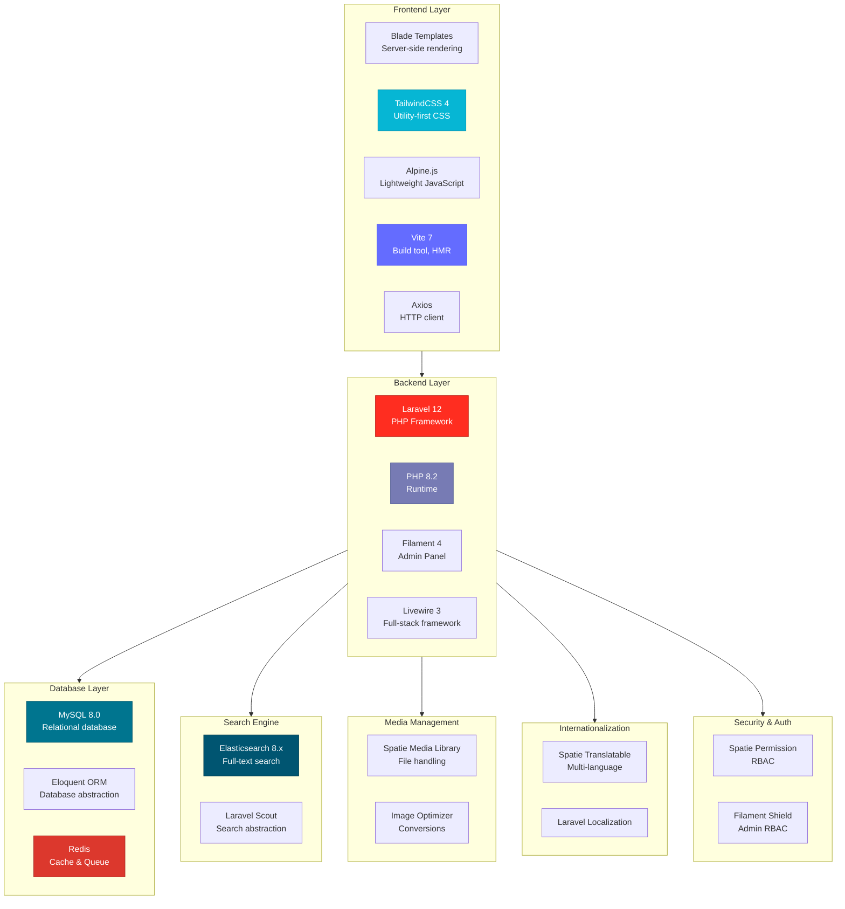

# Tech Stack Documentation

## Overview

VapeArt v2 is a modern e-commerce platform built with a carefully selected technology stack optimized for performance, scalability, and developer productivity.

## Technology Stack Diagram



## Core Technologies

### Backend Framework

#### Laravel 12.x
- **Version:** 12.0
- **Language:** PHP 8.2
- **License:** MIT
- **Website:** https://laravel.com

**Why Laravel:**
- Modern PHP framework with excellent documentation
- Built-in features: ORM, routing, authentication, caching, queuing
- Large ecosystem of packages
- Active community support
- Rapid development capabilities

**Key Features Used:**
- Eloquent ORM for database operations
- Blade templating engine
- Queue system for background jobs
- Task scheduling (cron)
- Service container and dependency injection
- Middleware for request processing
- Migration system for database versioning
- Artisan CLI for development tasks

**Configuration Files:**
- `config/app.php` - Application settings
- `config/database.php` - Database connections
- `config/cache.php` - Cache configuration
- `config/queue.php` - Queue settings
- `config/filesystems.php` - Storage configuration

### PHP Runtime

#### PHP 8.2
- **Version:** 8.2+
- **License:** PHP License
- **Website:** https://www.php.net

**Required Extensions:**
- `pdo_mysql` - MySQL database driver
- `mbstring` - Multi-byte string support
- `xml` - XML processing
- `gd` - Image manipulation
- `curl` - HTTP requests
- `zip` - Archive handling
- `redis` - Redis client
- `bcmath` - Precision mathematics
- `intl` - Internationalization

**PHP 8.2 Features Used:**
- Readonly classes
- Enumerations (Enums)
- Named arguments
- Attributes
- Union types
- Null-safe operator

### Admin Panel

#### Filament 4.x
- **Version:** 4.0
- **Framework:** Laravel Livewire
- **License:** MIT
- **Website:** https://filamentphp.com

**Features:**
- CRUD resource management
- Form builder with validation
- Table builder with filters and actions
- Dashboard with widgets
- Role-based access control
- Media uploads
- Multi-language support
- Customizable theme

**Filament Packages Used:**
- `filament/filament` - Core admin panel
- `filament/spatie-laravel-media-library-plugin` - Media integration
- `bezhansalleh/filament-shield` - Permission management
- `bezhansalleh/filament-language-switch` - Language switcher
- `leandrocfe/filament-apex-charts` - Charts and analytics

**Admin Resources:**
- Products (most complex)
- Categories (tree structure)
- Brands
- Blogs
- Pages
- Menus
- Banners
- Tags
- Discounts
- Reviews
- Users
- Settings

## Frontend Technologies

### CSS Framework

#### TailwindCSS 4.x
- **Version:** 4.1.16
- **Type:** Utility-first CSS framework
- **License:** MIT
- **Website:** https://tailwindcss.com

**Features:**
- Utility-first approach
- Responsive design utilities
- Dark mode support
- Custom color palette
- JIT (Just-In-Time) compilation
- Plugin ecosystem

**Build Integration:**
- Vite plugin: `@tailwindcss/vite`
- Automatic purging of unused styles
- PostCSS processing

### JavaScript

#### Alpine.js
- **Version:** 3.x (via Filament/Livewire)
- **Type:** Lightweight JavaScript framework
- **License:** MIT
- **Website:** https://alpinejs.dev

**Usage:**
- Interactive UI components
- Dropdowns and modals
- Form interactions
- Client-side state management

#### Axios
- **Version:** 1.11.0
- **Type:** HTTP client
- **License:** MIT

**Usage:**
- AJAX requests
- API calls from frontend
- Autocomplete searches
- Load more pagination

### Build Tool

#### Vite 7.x
- **Version:** 7.0.7
- **Type:** Frontend build tool
- **License:** MIT
- **Website:** https://vitejs.dev

**Features:**
- Lightning-fast HMR (Hot Module Replacement)
- Optimized production builds
- TailwindCSS integration
- Asset versioning
- Code splitting

**Configuration:** `vite.config.js`

```javascript
plugins: [
    laravel({
        input: [
            'resources/css/filament-admin.css',
            'resources/js/app.js',
        ],
        refresh: true,
    }),
    tailwindcss(),
]
```

## Database Technologies

### Relational Database

#### MySQL 8.0
- **Version:** 8.0+
- **Alternative:** PostgreSQL 14+
- **License:** GPL
- **Website:** https://www.mysql.com

**Features:**
- ACID compliance
- JSON column type (for translations)
- Full-text search (fallback)
- Stored procedures
- Transactions

**Schema Management:**
- 26 migration files
- Foreign key constraints
- Indexes for performance

**Character Set:** UTF8MB4 (full Unicode support)

### ORM

#### Eloquent ORM
- **Part of:** Laravel
- **Version:** 12.x

**Features:**
- Active Record pattern
- Relationships (BelongsTo, HasMany, ManyToMany)
- Query builder
- Eager loading
- Soft deletes
- Model events
- Observers
- Scopes

**Models:** 24 models representing database tables

### Cache & Queue

#### Redis
- **Version:** 6.x+
- **License:** BSD
- **Website:** https://redis.io

**Usage:**
1. **Cache:** Application data caching
2. **Sessions:** User session storage
3. **Queue:** Background job queue

**Configuration:**
```env
CACHE_DRIVER=redis
SESSION_DRIVER=redis
QUEUE_CONNECTION=redis
```

**Cache Strategy:**
- TTL: 3600 seconds (1 hour)
- Tagged cache for easy invalidation
- Cache key prefixes

## Search Engine

### Elasticsearch

#### Elasticsearch 8.x
- **Version:** 8.19.0
- **License:** Elastic License / SSPL
- **Website:** https://www.elastic.co

**Features:**
- Full-text search
- Real-time indexing
- Faceted search
- Multi-language analysis
- Autocomplete
- Fuzzy matching

**Integration:**
- Package: `matchish/laravel-scout-elasticsearch`
- Index: `vapeart`
- Searchable model: Product

**Index Mapping:**
```json
{
  "properties": {
    "name": { "type": "text" },
    "description": { "type": "text" },
    "price": { "type": "float" },
    "brand_id": { "type": "integer" },
    "category_ids": { "type": "integer" },
    "is_active": { "type": "boolean" }
  }
}
```

#### Laravel Scout
- **Version:** 10.x
- **Package:** `laravel/scout`

**Configuration:** `config/scout.php`

**Features:**
- Searchable trait for models
- Automatic indexing on save/delete
- Custom search queries
- Pagination support

## Key Laravel Packages

### Spatie Packages

#### 1. Spatie Media Library
- **Package:** `spatie/laravel-medialibrary` v11.15
- **Purpose:** File uploads and media management

**Features:**
- Multiple file collections
- Image conversions (thumbnails)
- Responsive images
- Media metadata
- Custom properties

**Collections:**
- `thumbnail` - Product main image
- `images` - Product gallery
- `featured` - Blog images
- `banners` - Marketing banners

**Conversions:**
```php
registerMediaConversions()
    ->addMediaConversion('thumb')->width(300)->height(300)
    ->addMediaConversion('medium')->width(600)->height(600)
```

#### 2. Spatie Translatable
- **Package:** `spatie/laravel-translatable` v6.11
- **Purpose:** Multi-language content

**Features:**
- JSON-based translations
- Automatic locale detection
- Fallback to default locale
- Translation accessors

**Translatable Models:**
- Product (name, description, specs)
- Category (name, description)
- Brand (name, description)
- Blog (title, body, excerpt)
- Page (title, body)
- Menu (label)
- Tag (name)

**Usage:**
```php
$product->name // Current locale
$product->getTranslation('name', 'en')
```

#### 3. Spatie Permission
- **Package:** `spatie/laravel-permission` v6.21
- **Purpose:** Role-based access control

**Features:**
- Roles and permissions
- Guard support
- Middleware
- Blade directives
- Gate integration

**Roles:**
- Super Admin
- Admin
- Content Manager
- Moderator

**Permissions:**
- Category: view, create, edit, delete
- Product: view, create, edit, delete
- Blog: view, create, edit, delete
- User: manage
- Settings: manage

#### 4. Spatie Query Builder
- **Package:** `spatie/laravel-query-builder` v6.3
- **Purpose:** API filtering and sorting

**Features:**
- Filter by fields
- Sort by columns
- Include relationships
- Sparse fieldsets

**Usage:**
```php
QueryBuilder::for(Product::class)
    ->allowedFilters(['brand_id', 'category_id'])
    ->allowedSorts('price', 'created_at')
```

#### 5. Spatie Sitemap
- **Package:** `spatie/laravel-sitemap` v7.3
- **Purpose:** SEO sitemap generation

**Features:**
- XML sitemap
- Automatic crawling
- Custom URLs
- Change frequency
- Priority

#### 6. Spatie Schema.org
- **Package:** `spatie/schema-org` v3.23
- **Purpose:** Structured data markup

**Usage:**
- Product schema
- Organization schema
- BreadcrumbList schema

#### 7. Spatie Eloquent Sortable
- **Package:** `spatie/eloquent-sortable` v4.5
- **Purpose:** Drag-and-drop sorting

**Models Using Sortable:**
- Category (tree sorting)
- Menu items
- Banners

### Other Key Packages

#### Lara-Zeus Translatable (Filament)
- **Package:** `lara-zeus/spatie-translatable` v1.0
- **Purpose:** Filament integration for translations

**Features:**
- Translatable form fields
- Language switcher in admin
- Validation per locale

#### FlowFrame Laravel Trend
- **Package:** `flowframe/laravel-trend` v0.4.0
- **Purpose:** Analytics and trending data

**Usage:**
- Sales trends
- Popular products
- Traffic analytics

#### Laravel Tinker
- **Package:** `laravel/tinker` v2.10.1
- **Purpose:** Interactive REPL

**Usage:**
```bash
php artisan tinker
>>> App\Models\Product::count()
>>> App\Services\ElasticsearchService::class
```

## Development Tools

### Composer
- **Version:** 2.x
- **Purpose:** PHP dependency manager
- **Website:** https://getcomposer.org

**Key Commands:**
```bash
composer install
composer update
composer dump-autoload
```

### NPM
- **Version:** 9.x+ (bundled with Node.js)
- **Purpose:** JavaScript package manager

**Key Commands:**
```bash
npm install
npm run dev
npm run build
```

### Artisan CLI

Laravel's command-line interface:

**Common Commands:**
```bash
php artisan serve           # Development server
php artisan migrate         # Run migrations
php artisan db:seed         # Seed database
php artisan cache:clear     # Clear cache
php artisan queue:work      # Queue worker
php artisan schedule:work   # Scheduler
```

**Custom Commands:**
```bash
php artisan products:import         # Import products
php artisan blogs:import            # Import blogs
php artisan elasticsearch:sync      # Sync products to Elasticsearch
```

## Code Quality & Testing

### Laravel Pint
- **Package:** `laravel/pint` v1.24
- **Purpose:** Code style fixer

**Configuration:** Opinionated Laravel style

**Usage:**
```bash
./vendor/bin/pint
```

### PHPUnit
- **Package:** `phpunit/phpunit` v11.5.3
- **Purpose:** Unit and feature testing

**Test Structure:**
```
tests/
├── Feature/    # Integration tests
└── Unit/       # Unit tests
```

**Usage:**
```bash
php artisan test
```

### Laravel Pail
- **Package:** `laravel/pail` v1.2.2
- **Purpose:** Real-time log viewing

**Usage:**
```bash
php artisan pail
```

## Version Control

### Git
- **Repository:** Private/GitHub
- **Branches:**
  - `main` - Production
  - `develop` - Development
  - `feature/*` - Feature branches

**.gitignore:**
- `/vendor`
- `/node_modules`
- `.env`
- `/public/storage`
- `/storage/*.key`

## Deployment Stack

### Web Server

#### Nginx
- **Version:** 1.22+
- **Purpose:** Reverse proxy, static files

**Configuration:**
- SSL termination
- Gzip compression
- Static asset caching
- FastCGI for PHP

#### PHP-FPM
- **Version:** 8.2
- **Purpose:** PHP process manager

**Configuration:**
- Process pool (dynamic/static)
- Max children
- Max requests per child

### Process Management

#### Supervisor
- **Purpose:** Process monitoring

**Managed Processes:**
- Queue workers (4 processes)
- Scheduler (optional)

**Configuration:**
```ini
[program:vapeart-worker]
command=php artisan queue:work
numprocs=4
autostart=true
autorestart=true
```

### Task Scheduling

#### Cron
- **Purpose:** Scheduled tasks

**Crontab Entry:**
```bash
* * * * * cd /path && php artisan schedule:run >> /dev/null 2>&1
```

**Scheduled Tasks:**
- Daily Elasticsearch sync (00:00)
- Database backups
- Log rotation
- Cache warming

## External Services

### Email

**Providers:**
- SMTP (Mailgun, SendGrid, Amazon SES)
- Local SMTP for development

**Configuration:**
```env
MAIL_MAILER=smtp
MAIL_HOST=smtp.mailgun.org
MAIL_PORT=587
MAIL_ENCRYPTION=tls
```

### Storage

**Options:**
- Local filesystem (development)
- AWS S3
- DigitalOcean Spaces
- MinIO (self-hosted)

**Configuration:**
```env
FILESYSTEM_DISK=s3
AWS_BUCKET=vapeart-media
AWS_URL=https://cdn.example.com
```

### CDN

**Providers:**
- CloudFlare
- AWS CloudFront
- BunnyCDN

**Purpose:**
- Static asset delivery
- Image optimization
- Global edge caching

## Monitoring & Analytics

### Application Performance Monitoring

**Options:**
- Laravel Telescope (development)
- New Relic
- Datadog
- Sentry (error tracking)

### Server Monitoring

**Tools:**
- Prometheus + Grafana
- Uptime monitoring (UptimeRobot)
- Log aggregation (ELK stack)

## Summary Table

| Category | Technology | Version | Purpose |
|----------|-----------|---------|---------|
| **Backend** | Laravel | 12.x | PHP Framework |
| | PHP | 8.2+ | Runtime |
| **Admin** | Filament | 4.x | Admin Panel |
| | Livewire | 3.x | Full-stack framework |
| **Frontend** | Blade | - | Template engine |
| | TailwindCSS | 4.x | CSS framework |
| | Alpine.js | 3.x | JavaScript |
| | Vite | 7.x | Build tool |
| **Database** | MySQL | 8.0+ | RDBMS |
| | Redis | 6.x+ | Cache/Queue |
| **Search** | Elasticsearch | 8.x | Search engine |
| **Media** | Spatie Media Library | 11.x | File management |
| **i18n** | Spatie Translatable | 6.x | Multi-language |
| **RBAC** | Spatie Permission | 6.x | Authorization |
| **Server** | Nginx | 1.22+ | Web server |
| | PHP-FPM | 8.2 | Process manager |
| | Supervisor | 4.x | Process monitoring |

## Technology Decisions

### Why These Technologies?

1. **Laravel 12** - Modern, well-documented, rapid development
2. **Filament 4** - Powerful admin panel, saves months of development
3. **TailwindCSS** - Utility-first, highly customizable, small bundle size
4. **Elasticsearch** - Superior search performance for large catalogs
5. **Redis** - Fast in-memory caching and queue
6. **Spatie Packages** - Battle-tested, well-maintained Laravel packages
7. **Vite** - Fast builds, excellent DX with HMR
8. **MySQL** - Reliable, familiar, good Laravel support

### Alternative Considerations

**Could Use Instead:**
- PostgreSQL instead of MySQL (better JSON support)
- Meilisearch instead of Elasticsearch (simpler, less resource-heavy)
- Horizon instead of basic queue workers (better monitoring)
- Inertia.js instead of Blade (SPA-like experience)
- Vue/React instead of Alpine.js (more complex interactions)

## License Summary

| Package | License | Commercial Use |
|---------|---------|----------------|
| Laravel | MIT | ✅ Yes |
| Filament | MIT | ✅ Yes |
| TailwindCSS | MIT | ✅ Yes |
| MySQL | GPL | ✅ Yes |
| Redis | BSD | ✅ Yes |
| Elasticsearch | Elastic License 2.0 | ⚠️ Check terms |
| All Spatie packages | MIT | ✅ Yes |

**Note:** Elasticsearch changed from Apache 2.0 to Elastic License in version 7.11. For production use, review the Elastic License or consider OpenSearch (Apache 2.0 fork).
